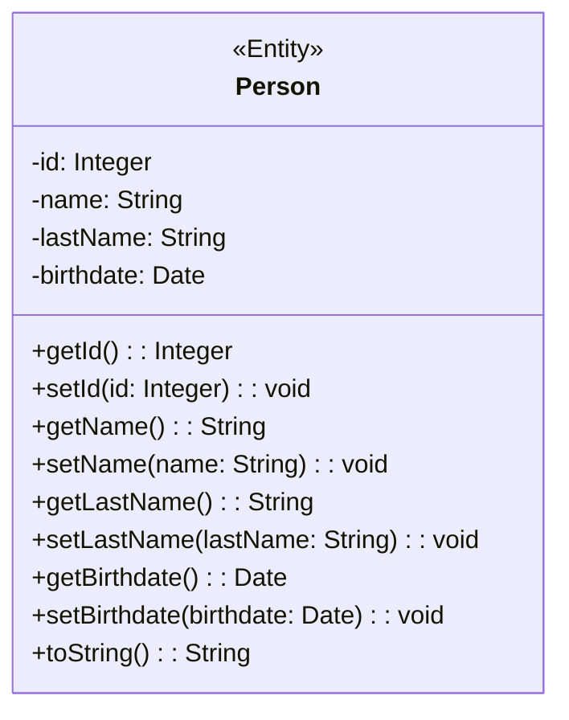
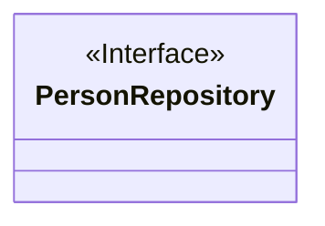
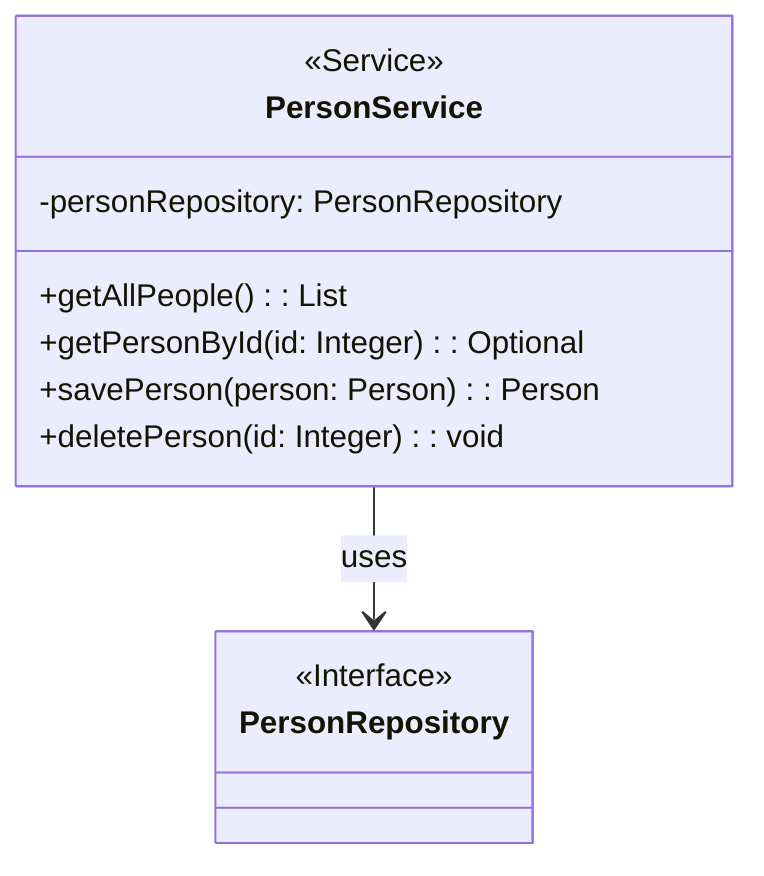
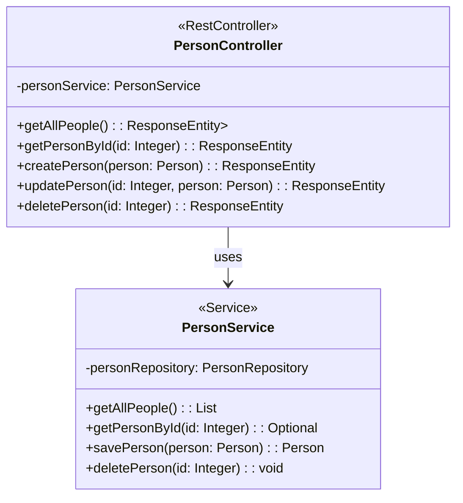

# People Manager assignment
I'd like you to demonstrate your ability to set up a Spring Java project for CRUD operations in a MySQL database. You'll be using an IDE for this task. Let's get started.

You'll be building a People Manager application. It's a simple Spring Java project that allows users to perform CRUD operations (Create, Read, Update, Delete) on a person's details like their name, last name, and birthdate.

You'll need to use Spring Web, Spring Data JPA, and the MySQL Driver for database connectivity.

TTD: Unit tests PersonRepositoryTest and PersonControllerTest have been provided in step 8, all tests should pass with your code.

#### Prerequisites 

 - IDE
 - Java JDK 11+
 - MySQL server 8+ (configured and ready to create a DB schema)
 - MySQL Workbench (optional) 

### Step 1: Create a Maven Project

1.  Open your IDE and create a new Maven project.
    
2.  Fill in the group id as `com.interview` and the artifact id as `people-manager`.

#### Note:
You can also use [Spring initializer](https://start.spring.io/)
    

### Step 2: Add Dependencies

1.  Open the pom.xml file.
    
2.  Add dependencies for Spring Web, Spring Data JPA, and MySQL Driver:
    

``` xml
 <dependencies>
        <dependency>
            <groupId>org.springframework.boot</groupId>
            <artifactId>spring-boot-starter-data-jpa</artifactId>
        </dependency>
        <dependency>
            <groupId>org.springframework.boot</groupId>
            <artifactId>spring-boot-starter-web</artifactId>
        </dependency>
        <dependency>
            <groupId>com.mysql</groupId>
            <artifactId>mysql-connector-j</artifactId>
            <scope>runtime</scope>
        </dependency>
        <dependency>
            <groupId>org.springframework.boot</groupId>
            <artifactId>spring-boot-starter-test</artifactId>
            <scope>test</scope>
        </dependency>
    </dependencies>
```
    

### Step 3: Configure Database Connection

1.  Open the application.properties file located in src/main/resources.
    
2.  Configure the database connection properties:
    
      ``` properties
        spring.datasource.url=jdbc:mysql://localhost:3306/peopledb
        spring.datasource.username=
        spring.datasource.password=
        spring.datasource.driver-class-name=com.mysql.cj.jdbc.Driver
        spring.jpa.hibernate.ddl-auto=update
      ```
        
3.  Create new peopledb shema in the DB
    
    1.  You can use the console or mySQL workbench or IDE
        

### Step 4: Create Entity Class

1.  Create a new Java class named Person in the com.interview.peoplemanager.model package
    
2.  Define a Person entity class with fields:
    
    1.  id:Integer ( generated value strategy = GenerationType.IDENTITY)
        
    2.  name:String,
        
    3.  lastName:String
        
    4.  birthdate:Date.



### Step 5: Create Repository Interface

1.  Create a new Java interface named PersonRepository in the com.interview.peoplemanager.repository package which defines a repository interface for CRUD operations on the Person entity
    


### Step 6: Create Service Class

1.  Create a new Java class named PersonService in the com.interview.peoplemanager.service package which implements business logic in a service class to interact with the repository
    


### Step 7: Create Controller Class

1.  Create a new Java class named PersonController in the com.interview.peoplemanager.controller package. Implement RESTful endpoints in a controller class for handling HTTP requests
    

-   All methods return ResponseEntity objects, allowing for better control over HTTP status codes and response bodies.
    
-   The getAllPeople (GET) method returns a ResponseEntity containing the list of people with an HTTP status of OK.
    
-   The getPersonById (GET) method returns a ResponseEntity with the person if found or NOT_FOUND status if not found.
    
-   The createPerson (POST) method returns a ResponseEntity with the created person and a CREATED status.
    
-   The updatePerson (PUT) method returns a ResponseEntity with the updated person and an OK status if the person is found, or NOT_FOUND status if not found.
    
-   The deletePerson (DELETE) method returns a ResponseEntity with a NO_CONTENT status after successfully deleting the person.
    


### Step 8: Unit Tests

#### PersonRepositoryTest

1.  Create unit tests called for PersonRepositoryTest in the package com.interview.peoplemanager.repository under the **test** directory
    
2.  Copy the code:
    
    ``` Java
    package com.interview.peoplemanager.repository;


    import java.sql.Date;

    import org.assertj.core.api.Assertions;
    import org.junit.jupiter.api.Test;
    import org.springframework.beans.factory.annotation.Autowired;
    import org.springframework.boot.test.autoconfigure.jdbc.AutoConfigureTestDatabase;
    import org.springframework.boot.test.autoconfigure.orm.jpa.DataJpaTest;
    import org.springframework.test.annotation.Rollback;

    import com.interview.peoplemanager.model.Person;

    @DataJpaTest
    @AutoConfigureTestDatabase(replace = AutoConfigureTestDatabase.Replace.NONE)
    @Rollback(false)
    class PersonRepositoryTest {
        @Autowired
        private PersonRepository repo;
    
        @Test
        public void testAddNew(){
            Person person    = new Person("John","Smith", new Date(375485579000L));
            Person savedPerson = repo.save(person);
            Assertions.assertThat(savedPerson).isNotNull();
            person    = new Person("Jane","Smith", new Date(474327179000L));
            savedPerson = repo.save(person);
            Assertions.assertThat(savedPerson).isNotNull();
            Assertions.assertThat(savedPerson.getId()).isGreaterThan(0);

        }
    }
    
    ```
    
3.  Run the PersonRepositoryTest
    
4.  Verify that the table person was created
    
5.  Verify the columns
    
6.  Verify that 2 entries have been added to the person table.
    

#### PersonControllerTest

1.  Create unit tests called for PersonControllerTest in the package com.interview.peoplemanager.controller under the **test** directory
    
2.  Copy the code:
    
    ``` Java
    package com.interview.peoplemanager.controller;
    import org.junit.jupiter.api.BeforeEach;
    import org.junit.jupiter.api.Test;
    import org.mockito.InjectMocks;
    import org.mockito.Mock;
    import org.mockito.MockitoAnnotations;
    import org.springframework.http.HttpStatus;
    import org.springframework.http.ResponseEntity;

    import java.sql.Date;
    import java.util.Arrays;
    import java.util.List;
    import java.util.Optional;
    
    import static org.junit.jupiter.api.Assertions.assertEquals;
    import static org.mockito.Mockito.*;

    import com.interview.peoplemanager.model.Person;
    import com.interview.peoplemanager.service.PersonService;

    class PersonControllerTest {
    @Mock
    private PersonService personService;

    @InjectMocks
    private PersonController personController;

    @BeforeEach
    void setUp() {
        MockitoAnnotations.openMocks(this);
    }

    @Test
    void testGetAllPeople() {

        List<Person> people = Arrays.asList(
                new Person("John", "Doe", new Date(375485579000L)),
                new Person("Jane", "Doe", new Date(474327179000L)));
        when(personService.getAllPeople()).thenReturn(people);

        ResponseEntity<List<Person>> response = personController.getAllPeople();

        assertEquals(HttpStatus.OK, response.getStatusCode());
        assertEquals(people, response.getBody());
    }

    @Test
    void testGetPersonByIdFound() {
        int id = 1;
        Person person = new Person("John",
                "Doe",
                new Date(375485579000L));
        when(personService.getPersonById(id)).thenReturn(Optional.of(person));

        ResponseEntity<Person> response = personController.getPersonById(id);

        assertEquals(HttpStatus.OK, response.getStatusCode());
        assertEquals(person, response.getBody());
    }

    @Test
    void testGetPersonByIdNotFound() {
        int id = 1;
        when(personService.getPersonById(id)).thenReturn(Optional.empty());

        ResponseEntity<Person> response = personController.getPersonById(id);

        assertEquals(HttpStatus.NOT_FOUND, response.getStatusCode());
    }

    @Test
    void testCreatePerson() {
        Person person = new Person("John", "Doe", new Date(375485579000L));
        when(personService.savePerson(person)).thenReturn(person);

        ResponseEntity<Person> response = personController.createPerson(person);

        assertEquals(HttpStatus.CREATED, response.getStatusCode());
        assertEquals(person, response.getBody());
    }

    @Test
    void testUpdatePersonFound() {
        int id = 1;
        Person person = new Person("John", "Doe", new Date(375485579000L));
        when(personService.getPersonById(id)).thenReturn(Optional.of(person));
        when(personService.savePerson(person)).thenReturn(person);

        ResponseEntity<Person> response = personController.updatePerson(id, person);

        assertEquals(HttpStatus.OK, response.getStatusCode());
        assertEquals(person, response.getBody());
    }

    @Test
    void testUpdatePersonNotFound() {
        int id = 1;
        Person person = new Person("John", "Doe", new Date(375485579000L));
        when(personService.getPersonById(id)).thenReturn(Optional.empty());

        ResponseEntity<Person> response = personController.updatePerson(id, person);

        assertEquals(HttpStatus.NOT_FOUND, response.getStatusCode());
    }

    @Test
    void testDeletePerson() {
        int id = 1;
        ResponseEntity<Void> response = personController.deletePerson(id);

        assertEquals(HttpStatus.NO_CONTENT, response.getStatusCode());
        verify(personService, times(1)).deletePerson(id);
    }
    }
    
    ```
    
3.  Run the PersonControllerTest
    
4.  All the tests should run
    

### Step 9: Run and Test the Application

1.  Run the Spring Boot application.
    
2.  Use tools like Postman or Swagger UI to test the CRUD operations for person details.
    
    1.  [http://localhost:8080/people/](http://localhost:8080/people/)
        
    2.  [http://localhost:8080/people/](http://localhost:8080/people/)1
        
    3.  [http://localhost:8080/people/](http://localhost:8080/people/)2
        
3.  Verify that CRUD operations are reflected correctly in the MySQL database.


### Step 10: Run and Test the Application

1. Upload the code to the Git repo in a branch  
2. Open a Pull request to merge with main
